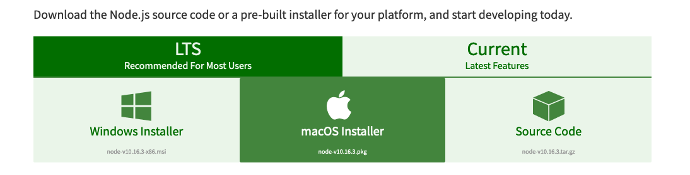

# Backstop Pre-reqs

## Here's what you'll need

There are only a few things you'll need to get started with BackstopJS.

1. **Install NodeJS**

   a. Go to [this site](https://nodejs.org/en/download/)

   b. Click either the Mac installer or the Windows installer depending on which operating system you have.



c. Double click the downloaded file and follow the installation steps.

d. To check it downloaded correctly, open Terminal \(if on a Mac\) or the Command Prompt \(if on Windows\) and type:

```text
$ node -v
```

If you get anything other than a number that looks like v9.0.0, your installation was unsuccessful.

1. **\(OPTIONAL\) Create a** [**Github account**](https://github.com/) if you haven't already.

   a. If you'd like a Git and Version Control primer, I recommend [this resource](https://hellowebbooks.com/learn-command-line/). It's free but does require you enter an email address.

